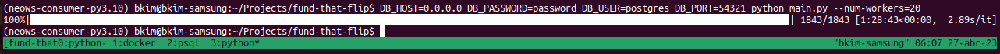

# Near Earth Object's API consumer

This project demonstrates how to consume objects from a rate-limited API. It exposes:

- Thread synchronization;
- Client rate limiting;
- Response to throttling with exponential backoff;
- Handling task retry;

## NASA NEO-WS API

Near Earth objects (NEOs) are solar system bodies whose orbits approach Earth's orbit.
NASA tracks thousands of these objects by a mandate from the US Congress, in an effort
to detect impacts that may have economical significance or may be life-threatening, and
hopefully allows us to prepare for them.

The NEO WebService API (NEO-WS) provides information about those objects, indexed by their
approach to our planet. This REST interface allows us to query for all objects whose
closest approach lies between two given dates, at most 7 days apart. For example, the query

[https://api.nasa.gov/neo/rest/v1/feed?**start\_date**=2023-01-01&**end_date**=2023-01-08&**api_key**=DEMO_KEY](https://api.nasa.gov/neo/rest/v1/feed?start_date=2023-01-01&end_date=2023-01-08&api_key=DEMO_KEY)

returns 110 objects that have their closest approach between Jan 1st 2023 and Jan 8th 2023 (inclusive).
The largest of them is "17511 (1992 QN)", with approximately 4,900 ft of diameter, that reached its closest approach
to Earth on Jan 6th and missed the planet by 28 million miles (a very safe distance).
The one to get closest was (2022 AV13), with only 6ft of diameter, that on Jan 5th passed mere 68 thousand miles from us.
For comparison, the average distance between the Earth and the Moon is 226 thousand miles.

## Installation & development

Pre-requisites: [poetry](https://python-poetry.org/), `libpg-fe.h` (found in `libpg-dev` package in Ubuntu)

After cloning the repo, run:

```sh
$ poetry install
$ poetry shell
(neows-consumer) $ pre-commit install --install-hooks -t pre-commit
(neows-consumer) $ pre-commit install --install-hooks -t pre-push
```

You may run fast checks with `pre-commit`:

```sh
(neows-consumer) $ pre-commit run --all-files
```

There are slower checks that run only before push. To run them, you need to add `--hook-stage`:

```sh
(neows-consumer) $ pre-commit run --all-files --hook-stage pre-push
```

To deploy the code with Docker, run

```sh
(neows-consumer) $ docker compose build
(neows-consumer) $ docker compose up -d
```

If you wish to run only the app against the Dockerized database, you can do so with:

```sh
(neows-consumer) $ DB_HOST=0.0.0.0 DB_PASSWORD=password DB_USER=postgres DB_PORT=54321 python main.py
```

## Data schema

The data we're interested in can be represented in the following pseudo-grammar:

```none
response ::= {
  "near_earth_objects": {(date: [neo*])*}
} ;
neo ::= {
  "neo_reference_id": string,
  "name": string,
  "absolute_magnitude_h": float,
  "estimated_diameter": {
    "feet": {
      "estimated_diameter_min": float,
      "estimated_diameter_max": float
    },
  },
  "is_potentially_hazardous_asteroid": boolean
  "close_approach_data": [close_approach*],
  "is_sentry_object": bool
} ;
close_approach ::= {
  "epoch_date_close_approach": timestamp_millis,
  "relative_velocity": {
    "miles_per_hour": float
  },
  "miss_distance": {
    "miles": float
  },
  "orbiting_body": string
} ;
```

Upon consuming the API, we noticed some quirks with the data:
- Each object should be associated with multiple close approaches, but upon consuming the API there's no instance where an object has more than 1.
- Orbiting body is always "Earth"

Given these, we converted the data to the following output table:

| Field | Type | Description |
|---|---|---|
| id | int | autoincrement database ID |
| ingest_time | timestamp | time when ingestion started |
| neo_reference_id | text | NEO ID, shown only with the last 4 characters |
| absolute_magnitude_h | float | Absolute magnitude H |
| estimated_diameter_min_ft | float | Minimum estimated diameter, in feet |
| estimated_diameter_max_ft | float | Maximum estimated diameter, in feet |
| is_potentially_hazardous_asteroid | bool | Whether the asteroid is considered potentially hazardous |
| is_sentry_object | bool |  |
| close_approach_date | timestamp | Date of closest approach |
| close_approach_velocity_mph | float | Relative velocity at closest approach, in miles per hour |
| close_approach_distance_miles | float | Distance from Earth at closest approach, in miles |

## Ingest design



The API documents a limit of 1000 requests/hour upon registering for an API key. For each request, it
provides the max limit and the current number of requests remaining via custom headers. In practice, the
advertised limit was always of 2000 requests/hour, but some intermediate infrastructure failed to
comply even with the lower limit. The solution was twofold:

- Rate limit in the client, using the [`pyrate_limiter` library](pyratelimiter.readthedocs.io/)
- Upon a request failure with code 429 Too Many Requests, stop all new requests and keep a single thread
  attempting again with exponential backoff. Once it's succesful, restart all other threads.

Threads are synchronized via a [`queue.SimpleQueue`](https://docs.python.org/3/library/queue.html#simplequeue-objects)
that stores all pending tasks.

1. Before starting thread workers, the queue is populated with 8-day windows of start-end dates to be queried, covering the entire desired range.
2. Each thread take one task at a time. In case of failure, the task is inserted back in the queue.
   * Each task has a retry count, that is incremented before reinsertion in case of an unexpected exception.
   * Throttling failures don't count for retries.
3. If a task is retried too many times (currently, 3), it is discarded to a dead-letter queue. This queue is dumped at
   the end of the ingestion
   * I expect that all queries have similar costs (although some weeks have more NEOs flying by, perhaps?), so if a task
     fail 3 times, it's likely that plenty of others are failing often as well.

## Testing

There are no unit tests in this project, because most of the implementation concerns either hard-to-test constructs
(network requests, concurrent execution) or are too simple to warrant them (data conversion).

To ensure at least some safety net, the repository is configured to run static pre-commit checks with `flake8` and `mypy`,
and pre-push checks with `pylint`. To install the hooks, view the [installation](#installation--development) section.

## Container

The application is containerized with Docker to create a Postgres database independent from the current environment.

## CLI

- `--start-date`: Start date in the past to start ingestion (end date is always today).
- `--num-workers`: number of concurrent workers to download. 15 is conservative, and 100 starts breaking other stuff.

## Bugs & Feature requests

- This API provides detailed information of available resources. We should use this response to gradually adjust the rate limiter,
  but `pyrate-limiter` doesn't support dynamic rates.
  - This information could even be displayed with `tqdm` by using a second progress bar!
- We're using one database connection per thread, which shouldn't be necessary. There may be a bug in `psycopg2`, since the error
  message appears only in a [very recent post in StackOverflow](https://stackoverflow.com/q/73803605/946814).
- Likewise, we could reuse TCP connections instead of setting one anew for each request.
  - ...or perhaps `requests` does this automatically for us? 🤔
- Currently I log verbosely only to the file `app.log`, but I'd like to surface errors to stdout as well. This would require
  configuring the root logger properly -- my first attempt, the root logger would also log verbose log messages :shrug:
- After quota is exhausted, all threads are parked in the turnstile waiting for it to be restored. Once it happens, the turnstile
  is unlocked and all threads try to go through at once. This leads to peaks in requests and CPU usage, both in the client and
  the server, and should be smoothed out.
